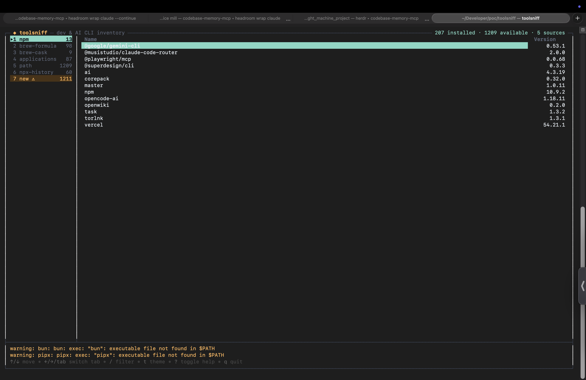

# toolsniff

**See every developer tool and AI app on your Mac in one place.**

`toolsniff` is a macOS inventory tool for developer CLIs, AI tools, package
manager installations, applications, and commands available on your `PATH`.
It tells you:

- What is installed.
- Where it came from.
- Whether a command is currently available.
- What changed since your last inventory.

It discovers tools instead of using a fixed list of “known” tools. If a new
CLI appears in a supported location, toolsniff can find it automatically.



## Why Use It?

Developer machines accumulate tools from Homebrew, npm, pipx, Cargo, Bun,
manual installs, and applications. Those tools are easy to forget and hard to
audit.

toolsniff gives you one readable inventory without pretending that every tool
was installed the same way.

```text
Installed by Homebrew     gh  2.75.0
Installed by npm          opencode-ai  1.18.11
Available through PATH    gh  /opt/homebrew/bin/gh
Changed since last scan   opencode-ai  1.18.10 -> 1.18.11
```

## Quick Start

See a one-time inventory:

```bash
toolsniff --list
```

Open the interactive terminal interface:

```bash
toolsniff
```

Save the current installed inventory as a baseline:

```bash
toolsniff --save
```

Later, see installed tools that were added, removed, or updated:

```bash
toolsniff --diff
```

Include changes to commands found on `PATH`:

```bash
toolsniff --diff --available
```

The normal `--diff` command focuses on installations. PATH changes are
opt-in because a command becoming available or unavailable is not proof that a
package was installed or removed.

## What It Finds

| Source | What it represents |
| --- | --- |
| `npm` | Globally installed npm packages |
| `brew-formula` | Homebrew command-line formulae |
| `brew-cask` | Homebrew casks and GUI applications |
| `pipx` | Isolated Python applications |
| `cargo` | Executables in Cargo's bin directory |
| `bun` | Executables in Bun's global bin directory |
| `applications` | `.app` bundles in `/Applications` and `~/Applications` |
| `path` | Executables currently available through `PATH` |
| `npx-history` | Cached one-off npx usage, shown for information only |

Different sources remain different observations. If `gh` exists in both
Homebrew and npm, toolsniff shows both entries instead of guessing that they
are the same installation.

## Install

### Homebrew Formula

The formula is available from the custom toolsniff tap:

```bash
brew tap pranvgarg/toolsniff
brew install pranvgarg/toolsniff/toolsniff
```

On newer Homebrew versions, a custom tap may also require trust:

```bash
brew trust pranvgarg/toolsniff
```

If your Homebrew installation reports outdated Apple Command Line Tools, that
is a Homebrew prerequisite problem. The toolsniff binary is prebuilt and does
not compile from source during a normal release install.

### Homebrew Cask Fallback

Use the cask when the formula path is not usable on your Homebrew/macOS
combination:

```bash
brew tap pranvgarg/toolsniff
brew install --cask pranvgarg/toolsniff/toolsniff
```

Install either the formula or the cask, not both. They are separate Homebrew
installations.

### Direct Installer

The direct installer does not require Go or Homebrew. It detects Apple Silicon
or Intel, downloads the matching release archive, verifies its SHA-256
checksum, and installs to `~/.local/bin/toolsniff`:

```bash
curl -fsSL https://raw.githubusercontent.com/pranvgarg/toolsniff/main/install.sh | sh
```

For a checked-out repository:

```bash
./install.sh
```

Direct installations are not managed by Homebrew. Run the installer again to
install a newer direct release.

### Build From Source

```bash
git clone https://github.com/pranvgarg/toolsniff.git
cd toolsniff
go build -o toolsniff .
```

Source builds currently require Go 1.26 or newer. The release binaries do not
require Go.

## Update toolsniff

`toolsniff --update` updates **toolsniff itself** when toolsniff was installed
by Homebrew. It does not update the other developer tools found by toolsniff.

Run it interactively:

```bash
toolsniff --update
```

Use `--yes` for automation:

```bash
toolsniff --update --yes
```

The command detects whether toolsniff is a formula or cask and runs the
matching Homebrew upgrade command. Direct and source installations are not
updated by this command.

## Common Commands

| Command | Purpose |
| --- | --- |
| `toolsniff` | Open the interactive TUI |
| `toolsniff --list` | Print a grouped inventory and exit |
| `toolsniff --json` | Print a machine-readable inventory |
| `toolsniff --save` | Save installed and PATH baselines |
| `toolsniff --diff` | Show installed additions, removals, and updates |
| `toolsniff --diff --available` | Include PATH availability changes |
| `toolsniff --update` | Update Homebrew-installed toolsniff |
| `toolsniff --update --yes` | Update without prompting |
| `toolsniff --version` | Print the toolsniff version |
| `toolsniff --config FILE` | Use a specific TOML configuration file |

Only one report or update mode should be selected at a time.

## Understanding The Output

### Installed

An installed observation comes from a package manager, Cargo/Bun bin
directory, or an application root. It is eligible for the installed baseline.

### Available

An available observation is an executable found on `PATH`. It tells you that a
command can currently be run, not how it got there.

### History

History observations, such as npx cache entries, are informational. They do not
enter the installed baseline and do not create installation-change alerts.

### Updates

If the same source and identity reports a different known version, toolsniff
reports an update:

```text
UPDATED
  ~ opencode-ai (npm) 1.18.10 -> 1.18.11
```

A path change remains a removal plus an addition because the executable location
is part of the observation identity.

## Configuration

The optional configuration file is:

```text
~/.config/toolsniff/config.toml
```

Use `--config` or environment variables for a different setup. A minimal
example:

```toml
[applications]
roots = ["/Applications", "~/Applications"]

[path]
exclude_directories = ["/custom/system/bin"]
ignore_names = ["internal-debug-tool"]

[bun]
enabled = true

[theme]
preset = "toolsniff"

[registry]
path = "~/.toolsniff/registry.json"

[execution]
timeout = "8s"
```

See [`docs/configuration.md`](docs/configuration.md) for all settings.

## TUI Controls

| Key | Action |
| --- | --- |
| `Up` / `Down` or `k` / `j` | Move through the active source |
| `Left` / `Right` or `h` / `l` | Switch source |
| `1`-`9` | Jump to a source |
| `/` | Filter the active source |
| `d` | Open the changes tab |
| `s` | Save the installed baseline |
| `t` | Open the theme picker |
| `?` | Show all controls |
| `q` | Quit |

## Troubleshooting Homebrew

Check the active developer tools path:

```bash
xcode-select -p
brew config
```

Check for available Apple updates:

```bash
softwareupdate --list
```

Install the exact Command Line Tools update shown by that command through
Software Update. Only if the standalone installation is stuck should you
remove and reinstall it:

```bash
sudo rm -rf /Library/Developer/CommandLineTools
sudo xcode-select --install
```

If Homebrew cannot be made usable on the Mac, use the direct installer instead.

## Scope

toolsniff currently targets macOS. It is designed for a developer or AI-tool
inventory, not for package updates, uninstallation, security scanning, or
maintaining a curated list of tool names.

## More Documentation

- [`docs/configuration.md`](docs/configuration.md) — configuration reference.
- [`docs/releasing.md`](docs/releasing.md) — release process.
- [`docs/releasing-homebrew-bottles.md`](docs/releasing-homebrew-bottles.md) — formula bottle workflow.
- [Homebrew tap](https://github.com/pranvgarg/homebrew-toolsniff)
- [GitHub releases](https://github.com/pranvgarg/toolsniff/releases)
