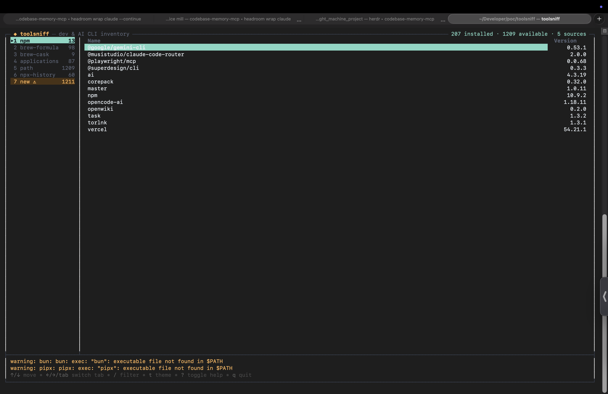

# toolsniff

**See every developer tool and AI app on your Mac in one place.**

`toolsniff` is a macOS inventory tool for developer CLIs, AI tools, package
manager installations, applications, and commands available on your `PATH`.
It tells you:

- What is installed.
- Where it came from.
- Whether a command is currently available.
- What changed since your last inventory.

It discovers tools instead of using a fixed list of “known” tools. If a new
CLI appears in a supported location, toolsniff can find it automatically.



## Why Use It?

Developer machines accumulate tools from Homebrew, npm, pipx, Cargo, Bun,
manual installs, and applications. Those tools are easy to forget and hard to
audit.

toolsniff gives you one readable inventory without pretending that every tool
was installed the same way.

```text
Installed by Homebrew     gh  2.75.0
Installed by npm          opencode-ai  1.18.11
Available through PATH    gh  /opt/homebrew/bin/gh
Changed since last scan   opencode-ai  1.18.10 -> 1.18.11
```

## Quick Start

See a one-time inventory:

```bash
toolsniff --list
```

Open the interactive terminal interface:

```bash
toolsniff
```

Save the current installed inventory as a baseline:

```bash
toolsniff --save
```

Later, see installed tools that were added, removed, or updated:

```bash
toolsniff --diff
```

Include changes to commands found on `PATH`:

```bash
toolsniff --diff --available
```

The normal `--diff` command focuses on installations. PATH changes are
opt-in because a command becoming available or unavailable is not proof that a
package was installed or removed.

Create a read-only health report:

```bash
toolsniff --doctor
```

Save and review point-in-time inventories:

```bash
toolsniff --snapshot
toolsniff --snapshots
```

Exports, comparisons, support bundles, and capability reports are described in
the [command reference](docs/configuration.md).

## What It Finds

| Source | What it represents |
| --- | --- |
| `npm` | Globally installed npm packages |
| `brew-formula` | Homebrew command-line formulae |
| `brew-cask` | Homebrew casks and GUI applications |
| `pipx` | Isolated Python applications |
| `cargo` | Executables in Cargo's bin directory |
| `bun` | Executables in Bun's global bin directory |
| `applications` | `.app` bundles in `/Applications` and `~/Applications` |
| `path` | Executables currently available through `PATH` |
| `npx-history` | Cached one-off npx usage, shown for information only |

Different sources remain different observations. If `gh` exists in both
Homebrew and npm, toolsniff shows both entries instead of guessing that they
are the same installation.

## Install

### Homebrew Formula

The formula is available from the custom toolsniff tap:

```bash
brew tap pranvgarg/toolsniff
brew install pranvgarg/toolsniff/toolsniff
```

On newer Homebrew versions, a custom tap may also require trust:

```bash
brew trust pranvgarg/toolsniff
```

If your Homebrew installation reports outdated Apple Command Line Tools, that
is a Homebrew prerequisite problem. The toolsniff binary is prebuilt and does
not compile from source during a normal release install.

### Homebrew Cask Fallback

Use the cask when the formula path is not usable on your Homebrew/macOS
combination:

```bash
brew tap pranvgarg/toolsniff
brew install --cask pranvgarg/toolsniff/toolsniff
```

Install either the formula or the cask, not both. They are separate Homebrew
installations.

### Direct Installer

The direct installer does not require Go or Homebrew. It detects Apple Silicon
or Intel, downloads the matching release archive, verifies its SHA-256
checksum, and installs to `~/.local/bin/toolsniff`:

```bash
curl -fsSL https://raw.githubusercontent.com/pranvgarg/toolsniff/main/install.sh | sh
```

For a checked-out repository:

```bash
./install.sh
```

Direct installations are not managed by Homebrew. Run the installer again to
install a newer direct release.

### Build From Source

```bash
git clone https://github.com/pranvgarg/toolsniff.git
cd toolsniff
go build -o toolsniff .
```

Source builds currently require Go 1.26 or newer. The release binaries do not
require Go.

## Update toolsniff

`toolsniff --update` updates **toolsniff itself** when toolsniff was installed
by Homebrew. It does not update the other developer tools found by toolsniff.

Run it interactively:

```bash
toolsniff --update
```

Use `--yes` for automation:

```bash
toolsniff --update --yes
```

The command detects whether toolsniff is a formula or cask and runs the
matching Homebrew upgrade command. Direct and source installations are not
updated by this command.

## Common Commands

| Command | Purpose |
| --- | --- |
| `toolsniff` | Open the interactive TUI |
| `toolsniff --list` | Print a grouped inventory and exit |
| `toolsniff --json` | Print a machine-readable inventory |
| `toolsniff --save` | Save installed and PATH baselines |
| `toolsniff --diff` | Show installed additions, removals, and updates |
| `toolsniff --diff --available` | Include PATH availability changes |
| `toolsniff --doctor` | Print read-only health and provenance findings |
| `toolsniff --snapshot` | Save a non-history snapshot |
| `toolsniff --snapshots` | List saved snapshots without scanning |
| `toolsniff --export-profile FILE` | Write a sanitized profile |
| `toolsniff --compare-profile FILE` | Compare the current scan with a profile |
| `toolsniff --support-bundle FILE` | Write a sanitized support bundle |
| `toolsniff --capabilities` | Print explicit capability results as JSON |
| `toolsniff --capabilities --capabilities-probe` | Add bounded version probes |
| `toolsniff --update` | Update Homebrew-installed toolsniff |
| `toolsniff --update --yes` | Update without prompting |
| `toolsniff --version` | Print the toolsniff version |
| `toolsniff --config FILE` | Use a specific TOML configuration file |

Only one report or update mode should be selected at a time.

## Understanding The Output

### v2 observations

The current report uses schema version 2. Each result is an observation with a
stable identity, kind, evidence-backed origin, typed locations, availability,
and optional package, application, or history metadata. A PATH observation
means that a command is available; it does not prove how the command was
installed.

Version values are stateful. The list displays `known`, `unknown`, `n/a`, or
`not reported` semantics instead of putting a path in a Version column. See
[`docs/observation-model-v2.md`](docs/observation-model-v2.md) for the JSON
contract, change events, and migration rules.

### Installed

An installed observation comes from a package manager, Cargo/Bun bin
directory, or an application root. It is eligible for the installed baseline.

### Available

An available observation is an executable found on `PATH`. It tells you that a
command can currently be run, not how it got there.

### History

History observations, such as npx cache entries, are informational. They do not
enter the installed baseline and do not create installation-change alerts.

### Changes

The v2 diff keeps typed events for additions, removals, updates, relocations,
broken locations, repairs, and newly shadowed commands. If the same stable
identity reports a different known version, toolsniff reports an update:

```text
UPDATED
  ~ opencode-ai (npm) 1.18.10 -> 1.18.11
```

A package or application path change can be a relocation because location and
identity are separate in v2. Unknown and not-reported versions are not guessed.

## Configuration

The optional configuration file is:

```text
~/.config/toolsniff/config.toml
```

Use `--config` or environment variables for a different setup. A minimal
example:

```toml
[applications]
roots = ["/Applications", "~/Applications"]

[path]
exclude_directories = ["/custom/system/bin"]
ignore_names = ["internal-debug-tool"]

[bun]
enabled = true

[theme]
preset = "toolsniff"

[registry]
path = "~/.toolsniff/registry.json"

[execution]
timeout = "8s"
```

See [`docs/configuration.md`](docs/configuration.md) for all settings.

## TUI Controls

| Key | Action |
| --- | --- |
| `Up` / `Down` or `k` / `j` | Move through the current view |
| `a` | Show all observations |
| `d` | Show typed changes |
| `i` | Show diagnostic issues |
| `/` | Search and enter optional facet filters |
| `f` | Open the filter drawer |
| `Enter` | Open read-only details for the selected observation |
| `Esc` | Close details, cancel a filter, or clear filters |
| `p` | Prepare the selected location path for copying |
| `c` | Prepare the selected observation JSON for copying |
| `o` | Prepare an `open -R` command for the selected location |
| `q` / `Ctrl-C` | Quit |

The filter drawer supports plain text plus ANDed facets such as
`source:npm`, `kind:application`, `version:unknown`, `status:updated`, and
`view:history`. Empty results explain the active filters. The detail view
keeps locations, availability, evidence, and optional metadata out of the
compact table.

## Privacy

Normal scans and local JSON reports retain local paths needed for inventory.
Profile exports and support bundles are sanitized: home-directory prefixes are
shown as `$HOME`, likely secret values are redacted, probe payloads and raw
evidence are omitted, and location hashes are not exported. Capability matching
uses explicit metadata or evidence, not display-name guesses. Executable
version probing is opt-in and bounded; `--capabilities` does not probe unless
`--capabilities-probe` is also supplied.

Existing v1 registry arrays are read and migrated to the v2 envelope without
discarding observations. The files are rewritten as v2 only by a successful
baseline save, and installed and PATH availability baselines remain separate.

## Troubleshooting Homebrew

Check the active developer tools path:

```bash
xcode-select -p
brew config
```

Check for available Apple updates:

```bash
softwareupdate --list
```

Install the exact Command Line Tools update shown by that command through
Software Update. Only if the standalone installation is stuck should you
remove and reinstall it:

```bash
sudo rm -rf /Library/Developer/CommandLineTools
sudo xcode-select --install
```

If Homebrew cannot be made usable on the Mac, use the direct installer instead.

## Scope

toolsniff currently targets macOS. It is designed for a developer or AI-tool
inventory, not for package updates, uninstallation, security scanning, or
maintaining a curated list of tool names.

## More Documentation

- [`docs/configuration.md`](docs/configuration.md) — configuration reference.
- [`docs/releasing.md`](docs/releasing.md) — release process.
- [`docs/observation-model-v2.md`](docs/observation-model-v2.md) — v2 schema,
  migration, exports, diagnostics, capabilities, and TUI behavior.
- [`docs/releasing-homebrew-bottles.md`](docs/releasing-homebrew-bottles.md) — formula bottle workflow.
- [Homebrew tap](https://github.com/pranvgarg/homebrew-toolsniff)
- [GitHub releases](https://github.com/pranvgarg/toolsniff/releases)
